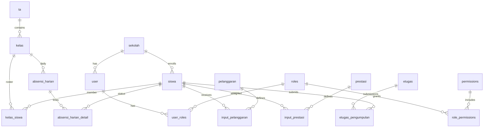

# DATABASE BLUEPRINT — EPOIN

**Database lokal:** `epoin_local`  
**Engine:** MySQL 8.x (lokal: 8.4.3)  
**Charset:** `utf8mb4` / `utf8mb4_unicode_ci`  
**Perkiraan jumlah tabel:** ~62 (menurut `docs/LOCAL_SETUP.md`)

> **Catatan sumber schema:** Dump SQL lengkap **tidak** disimpan di repo (`.gitignore` memblokir `*.sql` kecuali `database/manual-migrations/`). Blueprint ini disusun dari referensi kode, `admin/sekolah.php`, migrasi e-Tugas, dan dokumentasi setup.

---

## A. DAFTAR TABEL (dokumentasi)

| Tabel | Modul | PK (umum) | FK penting | Kolom penting | Sensitif |
|-------|-------|-----------|------------|---------------|----------|
| `siswa` | Auth siswa, master | `id` / `nis` | `kelas_id`, `ta_id` | `nis`, `nama`, `password`, `kelas_id` | **Ya** (password, data pribadi) |
| `user` | Auth staff | `user_id` | `sekolah_id` | `username`, `password`, `nama` | **Ya** |
| `roles` | RBAC | `role_id` | — | `role_key`, `role_name` | Tidak |
| `user_roles` | RBAC | composite | `user_id`, `role_id` | — | Tidak |
| `permissions` | RBAC | `perm_id` | — | `perm_key` | Tidak |
| `role_permissions` | RBAC | composite | `role_id`, `perm_id` | — | Tidak |
| `sekolah` | Tenant | `id` | — | nama sekolah, logo, config | Sedang |
| `sekolah_license` | Lisensi | `id` | `sekolah_id` | license key, expiry | **Ya** |
| `sekolah_license_log` | Lisensi audit | `id` | `sekolah_id` | event lisensi | **Ya** |
| `sekolah_staff` | Staff sekolah | `id` | `sekolah_id`, `user_id` | — | Sedang |
| `kelas` | Master | `kelas_id` | `ta_id`, `jurusan_id` | `nama_kelas` | Tidak |
| `kelas_siswa` | Relasi | `id` | `kelas_id`, `siswa_id` | tahun/semester | Sedang |
| `jurusan` | Master | `jurusan_id` | — | nama jurusan | Tidak |
| `ta` | Tahun ajaran | `ta_id` | — | tahun, semester | Tidak |
| `mapel` | Master | `mapel_id` | — | nama mapel | Tidak |
| `pengampu_mapel` | Guru–mapel–kelas | `id` | `user_id`, `mapel_id`, `kelas_id` | scope guru | Sedang |
| `pelanggaran` | Master poin | `pelanggaran_id` | — | `pelanggaran_point`, nama | Tidak |
| `prestasi` | Master poin | `prestasi_id` | — | `prestasi_point`, nama | Tidak |
| `input_pelanggaran` | Transaksi | `id` | `siswa_id`, `pelanggaran_id` | tanggal, poin, keterangan | **Ya** (data siswa) |
| `input_prestasi` | Transaksi | `id` | `siswa_id`, `prestasi_id` | tanggal, poin | **Ya** |
| `sp_log` | Pembinaan | `id` | `siswa_id` | tahap SP | **Ya** |
| `absensi_harian` | Absensi | `id` | `kelas_id`, `ta_id` | tanggal, status final | Sedang |
| `absensi_harian_detail` | Absensi | `id` | `absensi_harian_id`, `siswa_id` | H/I/S/A | **Ya** |
| `absensi_sesi` | Absensi mapel | `id` | `mapel_id`, `kelas_id` | sesi | Sedang |
| `absensi_sesi_detail` | Absensi mapel | `id` | `absensi_sesi_id`, `siswa_id` | status | **Ya** |
| `permohonan_absensi` | Workflow | `id` | siswa/guru | permohonan | Sedang |
| `nilai_*` / `deskripsi_*` | Penilaian | bervariasi | siswa, mapel, ta | nilai angka/huruf | **Ya** |
| `rapor` / leger | Rapor | bervariasi | siswa, ta | nilai akhir | **Ya** |
| `ujian_gform` | Ujian | bervariasi | kelas/mapel | link form, token | Sedang |
| `etugas` | e-Tugas | `id` | `kelas_id`, `mapel_id`, `guru_user_id` | judul, deadline, status | Sedang |
| `etugas_pengumpulan` | e-Tugas | `id` | `etugas_id`, `siswa_id` | jawaban, link, status | **Ya** |
| `audit_log` | Audit | `id` | `user_id`, `sekolah_id` | action, entity, meta JSON | **Ya** |
| `log_aktivitas` | Aktivitas guru | `id` | `user_id` | aktivitas, waktu | Sedang |
| `tenant_quota` | Kuota | `id` | `sekolah_id` | disk/bandwidth limit | Tidak |
| `usage_log` | Kuota | `id` | `sekolah_id` | bytes, action | Sedang |
| `migrations` | Schema version | `id` | — | nama migrasi | Tidak |
| `settings` | App settings | bervariasi | — | key-value | Sedang |
| `ci_sessions` / `sessions` | Session DB | — | — | session data | **Ya** |

*Tabel tambahan (nama dari kategori clear DB di `admin/sekolah.php`): master akademik, pengumuman, tujuan pembelajaran, dan tabel penilaian spesifik — verifikasi lengkap via `SHOW TABLES` di DB lokal.*

---

## B. RELASI DATABASE

### Inti akademik

```
ta (1) ──< kelas (N)
jurusan (1) ──< kelas (N)
kelas (1) ──< kelas_siswa (N) >── (1) siswa
kelas (1) ──< pengampu_mapel (N) >── user (guru)
mapel (1) ──< pengampu_mapel (N)
```

### Poin EPOIN

```
siswa (1) ──< input_pelanggaran (N) >── pelanggaran (1)
siswa (1) ──< input_prestasi (N) >── prestasi (1)
```

**Agregasi (view logic, bukan materialized view):**

```
saldo_siswa = SUM(prestasi.prestasi_point) - SUM(pelanggaran.pelanggaran_point)
```

### Auth & RBAC

```
user (N) ──< user_roles (N) >── roles (1)
roles (N) ──< role_permissions (N) >── permissions (1)
siswa ── login terpisah (bukan `user` table)
```

### Absensi

```
absensi_harian (1) ──< absensi_harian_detail (N) >── siswa
absensi_sesi (1) ──< absensi_sesi_detail (N) >── siswa
```

### e-Tugas

```
etugas (1) ──< etugas_pengumpulan (N) >── siswa
etugas ── kelas, mapel, user (guru)
UNIQUE (etugas_id, siswa_id) pada pengumpulan
```

### Tenant

```
sekolah (1) ──< sekolah_license, sekolah_staff, usage_log, tenant_quota
user.sekolah_id → sekolah.id
```

---

## C. ERD TEKS (Mermaid)



---

## D. TABEL PALING PENTING

| Prioritas | Tabel | Alasan |
|-----------|-------|--------|
| 1 | `siswa` | Identitas login siswa + semua modul mengacu NIS/id |
| 2 | `input_pelanggaran`, `input_prestasi` | Data transaksional inti EPOIN |
| 3 | `pelanggaran`, `prestasi` | Master poin — salah edit = seluruh perhitungan rusak |
| 4 | `kelas`, `kelas_siswa`, `ta` | Scope semua laporan dan filter |
| 5 | `user`, `roles`, `user_roles` | Keamanan akses admin |
| 6 | `sekolah`, `sekolah_license` | Multi-tenant & batas fitur |
| 7 | `absensi_harian_detail` | Data kehadiran sensitif & volume tinggi |
| 8 | `etugas`, `etugas_pengumpulan` | Modul aktif dengan submit file/link |

---

## E. DATA SENSITIF

| Kategori | Lokasi | Catatan |
|----------|--------|---------|
| Password staff | `user.password` | bcrypt atau MD5 legacy — jangan export ke publik |
| Password siswa | `siswa.password` | Historis **MD5** |
| License | `sekolah_license` | Key = `[REDACTED]` |
| Session | `ci_sessions` / PHP files | Jangan commit |
| Data siswa | `siswa.*`, input_*, absensi_* | UU PDP — backup terenkripsi |
| Nilai/rapor | tabel nilai/rapor | Integritas akademik |
| Audit | `audit_log`, `log_aktivitas` | Forensik — jangan dihapus sembarangan |

**Jangan tampilkan isi dump production di dokumentasi atau issue tracker.**

---

## F. CATATAN MIGRASI KE VPS

### Persiapan

1. **Backup lokal** sebelum export: `mysqldump epoin_local > backup_pre_deploy.sql` (simpan di luar repo).
2. Buat database kosong di aaPanel atau gunakan `CREATE DATABASE` dari dump.
3. Pastikan user DB punya hak `CREATE`, `ALTER`, `INDEX` jika import menyertakan FK.

### Kompatibilitas MySQL

- MySQL 8.x: OK untuk `utf8mb4`, `JSON` di `usage_log.meta`, `ENUM`.
- Perhatikan `sql_mode` (strict vs legacy) — bisa mempengaruhi INSERT tanpa default.
- `ENGINE=InnoDB` — wajib untuk FK.

### Risiko foreign key

- Import dump: urutan tabel harus parent → child, atau `SET FOREIGN_KEY_CHECKS=0` saat import lalu `=1`.
- Modul e-Tugas: jalankan `2026-05-17-001-create-etugas-tables.sql` **setelah** tabel `kelas`, `mapel`, `siswa`, `user` ada.

### Risiko import file besar

- Timeout PHP/nginx — import via **phpMyAdmin** atau **CLI mysql** di VPS, bukan lewat web app.
- `max_allowed_packet` naikkan jika dump > 64MB.

### Urutan import disarankan

1. Schema + data master (`sekolah`, `ta`, `jurusan`, `kelas`, `roles`, `permissions`)
2. `user`, `siswa`, relasi `kelas_siswa`
3. Master `pelanggaran`, `prestasi`, `mapel`
4. Transaksi (`input_*`, absensi, nilai)
5. Migrasi manual e-Tugas (jika belum ada di dump)
6. Verifikasi: `SELECT COUNT(*) FROM information_schema.tables WHERE table_schema='epoin_production'`

### Backup sebelum & sesudah deploy

| Waktu | Aksi |
|-------|------|
| Sebelum push kode | Dump DB + zip folder `uploads/` |
| Setelah import VPS | Dump DB production + snapshot files |
| Setelah auto-deploy | Dump incremental atau binlog jika tersedia |

---

## Migrasi di repository

File terverifikasi:

```sql
database/manual-migrations/2026-05-17-001-create-etugas-tables.sql
```

Tabel: `etugas`, `etugas_pengumpulan` dengan FK ke `kelas`, `mapel`, `siswa`, `user`.

---

*Untuk inventaris 62 tabel lengkap, jalankan di DB lokal (read-only): `SHOW TABLES;` dan `SHOW CREATE TABLE nama_tabel;` — hasil bisa dilampirkan ke dokumentasi internal tanpa commit dump ke Git.*
