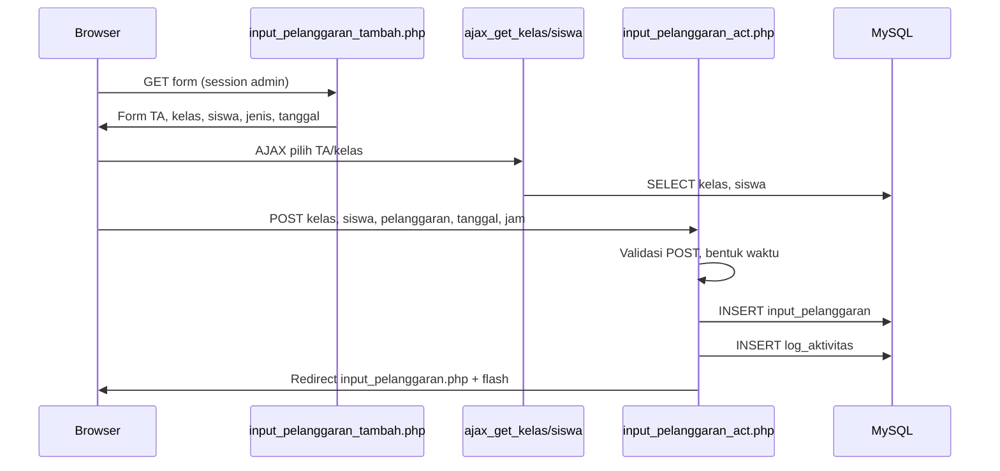

# MODUL EPOIN — DEEP ANALYSIS

**Scope:** Pelanggaran, prestasi, input poin siswa, riwayat, laporan, export  
**Mode:** Read-only (tidak ada perubahan kode)  
**Tanggal:** 2026-05-19  
**Project:** `C:\laragon\www\epoin`

> Credential/token ditulis sebagai `[REDACTED]`.

---

## 1. DAFTAR FILE TERKAIT

### 1.1 Master data — jenis pelanggaran & prestasi

| File | Peran | Akses (kode) |
|------|-------|----------------|
| `admin/pelanggaran.php` | CRUD UI master pelanggaran (`pelanggaran_nama`, `pelanggaran_point`) | Edit/hapus: `_is_admin()` |
| `admin/pelanggaran_act.php` | INSERT master | Tanpa session guard di file |
| `admin/pelanggaran_edit.php` | Form edit | Admin |
| `admin/pelanggaran_update.php` | UPDATE master | — |
| `admin/pelanggaran_hapus.php` | DELETE master + cascade input | — |
| `admin/prestasi.php` | CRUD UI master prestasi | Edit/hapus: `_is_admin()` |
| `admin/prestasi_act.php` | INSERT master | — |
| `admin/prestasi_edit.php` | Form edit | — |
| `admin/prestasi_update.php` | UPDATE master | — |
| `admin/prestasi_hapus.php` | DELETE master + cascade input | — |
| `siswa/pelanggaran.php` | Daftar master (read-only siswa) | Session siswa |
| `siswa/prestasi.php` | Daftar master (read-only siswa) | Session siswa |

### 1.2 Input transaksi poin (inti modul)

| File | Peran |
|------|-------|
| `admin/input_pelanggaran.php` | Daftar semua `input_pelanggaran` + filter DataTables |
| `admin/input_pelanggaran_tambah.php` | Form input (TA → kelas → siswa → jenis) + **CSRF token di form** |
| `admin/input_pelanggaran_act.php` | POST simpan → `INSERT input_pelanggaran` + `log_aktivitas` |
| `admin/input_pelanggaran_edit.php` | Form edit satu baris |
| `admin/input_pelanggaran_update.php` | POST update (raw SQL) |
| `admin/input_pelanggaran_hapus.php` | DELETE via `GET ?id=` |
| `admin/input_prestasi.php` | Daftar `input_prestasi` |
| `admin/input_prestasi_tambah.php` | Form input prestasi |
| `admin/input_prestasi_act.php` | POST simpan (prepared + fallback) |
| `admin/input_prestasi_edit.php` | Form edit |
| `admin/input_prestasi_update.php` | POST update |
| `admin/input_prestasi_hapus.php` | DELETE via GET |
| `admin/poin_kolektif.php` | **Input bulk** multi-siswa (JSON API + PDO terpisah) |

### 1.3 Riwayat & profil poin siswa

| File | Peran |
|------|-------|
| `admin/siswa_riwayat.php` | Riwayat gabungan, saldo, tahap pembinaan, terbit SP (`sp_log`), AJAX `issue_sp` |
| `admin/siswa.php` | Daftar siswa + kolom `saldo_poin` (subquery) |
| `admin/sp1_cetak.php` | Cetak surat SP1–SP4, hitung `negSaldo`, auto-insert `sp_log` |
| `admin/verifikasi_sp.php` | Verifikasi nomor SP publik (hash URL) |
| `siswa/index.php` | Dashboard: saldo, jumlah entri, feed aktivitas |
| `siswa/poin.php` | Halaman “Poin Saya” + aktivitas terbaru |
| `siswa/pelanggaran_saya.php` | Riwayat pelanggaran + filter tanggal/TA |
| `siswa/prestasi_saya.php` | Riwayat prestasi + filter |
| `siswa/rapor_poin_ringkas.php` | Cetak ringkas HTML saldo (tanpa layout penuh) |

### 1.4 Laporan, ranking, export

| File | Peran |
|------|-------|
| `admin/laporan.php` | Laporan per siswa/kelas, filter TA/kelas/saldo, **export Excel** inline |
| `admin/laporan_pdf.php` | PDF/print laporan (filter + bulan) |
| `admin/ranking_siswa.php` | Ranking semua siswa by skor |
| `admin/rekap_tahunan.php` | Rekap per tahun kalender |
| `admin/export_csv.php` | Export ZIP CSV kategori `pelanggaran` / `prestasi` (master + `sp_log`) |
| `admin/index.php` | Dashboard KPI + top pelanggaran + ranking TA aktif |

### 1.5 AJAX / helper pemilihan siswa

| File | Peran |
|------|-------|
| `admin/ajax_get_kelas.php` | Dropdown kelas by TA |
| `admin/ajax_get_siswa.php` | Dropdown siswa by kelas |
| `admin/ajax_kelas_by_ta.php` | Fragment kelas (GET) |
| `admin/ajax_siswa_by_kelas.php` | Fragment siswa via `kelas_siswa` |
| `admin/get_kelas_by_ta.php` | JSON kelas |
| `admin/get_siswa_by_kelas.php` | JSON siswa |
| `admin/autocomplete_siswa.php` | Autocomplete nama/NIS |

### 1.6 Cascade delete (menyentuh data poin)

| File | Dampak |
|------|--------|
| `admin/siswa_hapus.php` | Hapus `input_prestasi` / `input_pelanggaran` siswa |
| `admin/kelas_hapus.php` | Hapus input per kelas |
| `admin/jurusan_hapus.php` | Cascade input siswa jurusan |
| `admin/ta_hapus.php` | Cascade input per kelas TA |
| `admin/tools/reset_epoin.php` | Reset/truncate modul EPOIN |
| `admin/sekolah.php` | Backup/clear kategori pelanggaran/prestasi |

### 1.7 Shared / navigasi

| File | Peran |
|------|-------|
| `admin/header.php` | Menu modul EPOIN |
| `includes/modal_tentang_epoin.php` | Info modul |
| `includes/usage_helper.php` | Log kuota setelah insert (`usage_log_db_snapshot`) |

**Total:** ~60 file PHP terkait modul EPOIN (termasuk helper & cascade).

---

## 2. TABEL DATABASE MODUL EPOIN

### 2.1 Tabel transaksi & master (wajib)

| Tabel | Fungsi | PK | Kolom penting | Dipakai kode? |
|-------|--------|-----|---------------|---------------|
| **`pelanggaran`** | Master jenis pelanggaran | `pelanggaran_id` | `pelanggaran_nama`, `pelanggaran_point` | **Ya** — ratusan referensi |
| **`prestasi`** | Master jenis prestasi | `prestasi_id` | `prestasi_nama`, `prestasi_point` | **Ya** |
| **`input_pelanggaran`** | **Transaksi** pelanggaran per siswa | `id` | `waktu`, `siswa`, `kelas`, `pelanggaran`, opsional `ip_ym` | **Ya** — tabel inti |
| **`input_prestasi`** | **Transaksi** prestasi per siswa | `id` | `waktu`, `siswa`, `kelas`, `prestasi`, opsional `pr_ym` | **Ya** — tabel inti |

> **Tidak ada tabel `poin` terpisah.** Nilai poin disimpan di master (`*_point`) dan di-agregasi dari baris transaksi.

### 2.2 Tabel pendukung & log

| Tabel | Fungsi | Relasi |
|-------|--------|--------|
| `siswa` | Identitas siswa | `input_*.siswa` → `siswa.siswa_id` |
| `kelas` | Kelas saat input | `input_*.kelas` → `kelas.kelas_id` |
| `kelas_siswa` | Roster (`ks_siswa`, `ks_kelas`) | Pemilihan siswa di form |
| `ta` | Tahun ajaran | Filter via `kelas.kelas_ta` |
| `jurusan` | Tingkat/jurusan | Tampilan di list/riwayat |
| `user` | Guru/admin penginput | `log_aktivitas.user_id` |
| **`log_aktivitas`** | Audit teks aktivitas input | Setelah insert di `*_act.php` & `poin_kolektif` |
| **`sp_log`** | Surat peringatan terbit | `siswa_id`, `sp_level`, `nomor`, `alasan`, signer |

### 2.3 Tabel yang TIDAK dipakai untuk transaksi poin

Tidak ditemukan tabel alternatif (mis. `transaksi_poin`, `riwayat_poin`) yang menggantikan `input_pelanggaran` / `input_prestasi`. Semua agregasi memakai JOIN ke dua tabel transaksi tersebut.

### 2.4 Skema relasi (ringkas)

```
pelanggaran (1) ──< input_pelanggaran (N) >── siswa (1)
                      └── kelas (1)

prestasi (1) ──< input_prestasi (N) >── siswa (1)
                     └── kelas (1)

siswa (1) ──< sp_log (N)     [pembinaan / surat SP]
user (1) ──< log_aktivitas (N)  [jejak input, bukan baris poin]
```

---

## 3. ALUR LENGKAP BISNIS PROSES

### 3.1 Input pelanggaran (admin/guru) — jalur utama



**Langkah manusia:**

1. Guru/admin buka **Input Pelanggaran** (`input_pelanggaran_tambah.php`).
2. Pilih **tahun ajaran** → AJAX isi **kelas** → AJAX isi **siswa**.
3. Pilih **tanggal & jam**, pilih **jenis pelanggaran** (beserta poin di label option).
4. Submit → `input_pelanggaran_act.php` menyimpan **satu baris** di `input_pelanggaran`.
5. Poin **tidak disimpan di baris transaksi** — hanya `pelanggaran_id`; poin diambil dari master saat hitung/report.

### 3.2 Input prestasi — paralel

Alur identik dengan file `input_prestasi_*` → `INSERT input_prestasi`.

### 3.3 Input kolektif (banyak siswa sekaligus)

1. `admin/poin_kolektif.php` — UI + API `?action=save_bulk`.
2. Pilih tipe `pelanggaran` atau `prestasi`, pilih item master, pilih banyak siswa (pairs `siswa_id:kelas_id`).
3. Loop `INSERT` per siswa dalam transaksi PDO.
4. Log ke `log_aktivitas` per siswa.

> **Catatan arsitektur:** File ini memakai **koneksi PDO terpisah** dengan konfigurasi hardcoded `[REDACTED]` — tidak melalui `koneksi.php` / `.env` project.

### 3.4 Perhitungan & tampilan saldo

Setelah data tersimpan, **saldo tidak di-update ke kolom siswa**. Setiap halaman menghitung ulang:

```sql
total_prestasi  = SUM(prestasi.prestasi_point)  -- dari input_prestasi JOIN prestasi
total_pelanggaran = SUM(pelanggaran.pelanggaran_point) -- dari input_pelanggaran JOIN pelanggaran
saldo = total_prestasi - total_pelanggaran
```

**Tampilan:**

| Penonton | File | Data |
|----------|------|------|
| Siswa | `siswa/index.php`, `poin.php` | Saldo + riwayat |
| Admin | `siswa_riwayat.php?id=` | Riwayat UNION + tahap SP |
| Admin | `laporan.php`, `ranking_siswa.php` | Agregasi per siswa/kelas |

### 3.5 Riwayat

- **Per siswa (admin):** `siswa_riwayat.php` — UNION prestasi & pelanggaran, chart, tombol cetak SP.
- **Per siswa (siswa):** `pelanggaran_saya.php`, `prestasi_saya.php` — filter rentang tanggal & TA.
- **Dashboard:** `admin/index.php` — 300 aktivitas terbaru UNION.

### 3.6 Laporan & export

| Output | File | Mekanisme |
|--------|------|-----------|
| Excel laporan saldo | `laporan.php?export=excel` | HTML table `Content-Type: application/vnd.ms-excel` |
| PDF | `laporan_pdf.php?download=1` | Render PDF (filter TA/kelas/bulan) |
| Ranking | `ranking_siswa.php` | Sort PHP `usort` by skor |
| Rekap tahun | `rekap_tahunan.php?tahun=YYYY` | `YEAR(waktu)` pada input |
| CSV master | `export_csv.php?cat=pelanggaran\|prestasi` | ZIP CSV (`pelanggaran`, `prestasi`, `sp_log`) — **bukan** `input_*` |
| Rapor ringkas siswa | `siswa/rapor_poin_ringkas.php` | HTML print |

---

## 4. ALGORITMA PERHITUNGAN POIN

### 4.1 Model dasar

| Konsep | Perilaku |
|--------|----------|
| **Poin pelanggaran** | Setiap input menambah **beban minus** = `pelanggaran_point` dari master |
| **Poin prestasi** | Setiap input menambah **kredit plus** = `prestasi_point` dari master |
| **Saldo akhir** | `Σ prestasi − Σ pelanggaran` |
| **Penyimpanan transaksi** | Hanya referensi `pelanggaran_id` / `prestasi_id` — **bukan** nilai poin denormalized |

**Pseudocode:**

```
function saldo(siswa_id):
  plus  = SUM(prestasi.prestasi_point FOR each input_prestasi of siswa)
  minus = SUM(pelanggaran.pelanggaran_point FOR each input_pelanggaran of siswa)
  return plus - minus
```

**Contoh:** Prestasi +10, +5; Pelanggaran −3, −7 → saldo = 15 − 10 = **+5**.

### 4.2 Apakah poin pelanggaran “bertambah” atau “berkurang”?

- Di **database**, `pelanggaran_point` adalah bilangan positif di master.
- Di **UI/feed**, pelanggaran ditampilkan sebagai **negatif** dalam aktivitas gabungan (`-pelanggaran_point` di `admin/index.php` UNION).
- **Saldo** selalu: prestasi **menambah**, pelanggaran **mengurangi** saldo.

### 4.3 Apakah prestasi mengurangi pelanggaran?

Secara matematis **ya** — prestasi menaikkan saldo sehingga mengimbangi total pelanggaran. Tidak ada mekanisme “hapus baris pelanggaran otomatis”; hanya kompensasi lewat perhitungan.

### 4.4 Kategori ringan / sedang / berat

**Tidak ada kolom kategori** di tabel `pelanggaran` / `prestasi` dalam kode yang terbaca. Klasifikasi implisit hanya lewat:

- **Nama** jenis (`pelanggaran_nama`, `prestasi_nama`)
- **Besaran poin** (`pelanggaran_point`, `prestasi_point`) — admin bebas set angka (min 1 di form master)

Sekolah bisa menamai “Ringan (5 poin)” tanpa field terstruktur.

### 4.5 Status pembinaan & sanksi (SP)

Berdasarkan **`negSaldo = max(0, −saldo)`** (besar utang poin, bukan saldo positif):

| Tahap | negSaldo | Program (ringkas) | Surat |
|-------|----------|-------------------|-------|
| I | 1–20 | Pembinaan umum / teguran | SP1 |
| II | 21–40 | Panggilan ortu | SP1 |
| III | 41–60 | SP2 | SP2 |
| IV | 61–80 | Pembinaan khusus | SP3 |
| V | 81–90 | Konferensi kasus | SP4 |
| V | 91–99 | Tidak naik kelas | SP4 |
| VI | 100+ | Pemulangan ke ortu | SP4 |

**File:** `admin/sp1_cetak.php`, `admin/siswa_riwayat.php` (array `$STAGES` identik).

**Penerbitan SP:**

- Ambang cetak: SP1 jika `negSaldo >= 21`, SP2 `>= 41`, SP3 `>= 61`, SP4 `>= 81`.
- Record di **`sp_log`** (nomor surat, alasan, penandatangan).
- AJAX `siswa_riwayat.php?ajax=issue_sp` untuk terbit manual.

**Safe stage:** Jika saldo ≥ 0 → “Apresiasi / Monitoring”, tidak ada tindakan.

### 4.6 Batas poin

| Jenis batas | Ada? | Detail |
|-------------|------|--------|
| Maks poin per input | Tidak | Satu baris = satu kali jenis master |
| Maks saldo | Tidak | Hanya tahap SP dari `negSaldo` |
| Duplikasi harian | **Tidak** | Siswa + jenis sama bisa di-input berkali-kali |
| Batas master point | Form `min="1"` | Admin input angka bebas |

### 4.7 Kolom agregasi bulanan (opsional)

`input_pelanggaran_act.php` / `input_prestasi_act.php` mengecek kolom `ip_ym` / `pr_ym` (format `YYYYMM`) via `INFORMATION_SCHEMA` — untuk optimasi laporan bulanan jika migrasi DB sudah menambah kolom.

---

## 5. VERIFIKASI: APAKAH `input_pelanggaran` & `input_prestasi` DIPAKAI?

### 5.1 Kesimpulan: **YA, KEDUANYA AKTIF DAN WAJIB**

Bukti operasional:

| Operasi | File |
|---------|------|
| INSERT | `input_pelanggaran_act.php`, `input_prestasi_act.php`, `poin_kolektif.php` |
| SELECT list | `input_pelanggaran.php`, `input_prestasi.php` |
| SELECT agregasi | `laporan.php`, `ranking_siswa.php`, `siswa.php`, `siswa/index.php` |
| SELECT riwayat | `siswa_riwayat.php`, `pelanggaran_saya.php`, `prestasi_saya.php` |
| UPDATE | `input_pelanggaran_update.php`, `input_prestasi_update.php` |
| DELETE | `input_*_hapus.php`, cascade `*_hapus.php` master |

### 5.2 Tidak ada penyimpanan transaksi lain

Pencarian pola menunjukkan semua hitung poin mengacu ke dua tabel transaksi + master. `log_aktivitas` hanya **teks jejak**, bukan sumber hitung saldo.

---

## 6. DIAGRAM ALUR TEKS

### 6.1 Input pelanggaran (single)

```
[Browser]
    │
    ▼ GET
[input_pelanggaran_tambah.php]
    │ session via admin/header.php (staff login)
    │ generate CSRF token di session (form only)
    ▼
[Browser] pilih TA → AJAX → [ajax_get_kelas.php / get_kelas_by_ta.php]
         pilih Kelas → AJAX → [ajax_get_siswa.php / get_siswa_by_kelas.php]
    │
    ▼ POST (kelas, siswa, pelanggaran, tanggal, jam)
[input_pelanggaran_act.php]
    │ validasi: method POST, cast (int) id
    │ TIDAK validasi CSRF (token diabaikan)
    │ prepared INSERT (fallback raw SQL)
    ▼
[MySQL] INSERT input_pelanggaran
[MySQL] INSERT log_aktivitas
    │
    ▼ redirect
[input_pelanggaran.php] ──► tampil tabel JOIN siswa+kelas+pelanggaran
```

### 6.2 Tampil saldo siswa

```
[Browser] GET siswa/poin.php
    ▼
[siswa/header.php] cek $_SESSION['level'] === 'siswa'
    ▼
[siswa/poin.php]
    │ $id = $_SESSION['id']
    ▼
[MySQL] SUM prestasi_point WHERE input_prestasi.siswa = id
[MySQL] SUM pelanggaran_point WHERE input_pelanggaran.siswa = id
    │ $total = plus - minus
    ▼
[Browser] render KPI + tabel + chart (jika ada)
```

### 6.3 Laporan admin + export Excel

```
[Browser] GET laporan.php?ta_id=&kelas_id=&urutkan=net_point_tertinggi&export=excel
    ▼
[admin/header.php] session staff
    ▼
[laporan.php]
    │ build $sqlPerSiswa (subquery agregasi input_*)
    ▼
[MySQL] SELECT siswa + total_prestasi + total_pelanggaran + saldo
    │
    ├─ export=excel → header Excel + echo table (ob_clean)
    └─ else → HTML laporan + link PDF
```

### 6.4 Pembinaan SP

```
[Browser] GET siswa_riwayat.php?id=123
    ▼
[siswa_riwayat.php]
    │ hitung saldo dari input_*
    │ negSaldo → $currentStage
    ▼
[Browser] klik Cetak SP / issue_sp AJAX
    ▼
[sp_log INSERT] + [sp1_cetak.php] render PDF/surat
```

---

## 7. RISIKO KEAMANAN (MODUL EPOIN)

### 7.1 SQL injection

| Severity | File | Masalah |
|----------|------|---------|
| **Critical** | `pelanggaran_act.php` | `INSERT ... VALUES (NULL,'$nama','$point')` dari `$_POST` tanpa escape |
| **Critical** | `prestasi_act.php` | Pola sama (diperkirakan) |
| **High** | `input_pelanggaran_update.php` | `UPDATE ... waktu='$waktu', siswa='$siswa'...` concat POST |
| **High** | `input_pelanggaran_hapus.php` | `DELETE ... id='$id'` dari `$_GET` |
| **High** | `rekap_tahunan.php` | `YEAR(...) = '$tahun'` dari GET |
| **High** | `sp1_cetak.php`, `siswa_riwayat.php` | `WHERE ip.siswa='$id'` — id dari GET |
| **Medium** | `input_pelanggaran.php` list | Implicit join besar (bukan injeksi langsung, performa) |
| **Low** | `input_pelanggaran_act.php` | Prepared utama OK; fallback raw dengan int cast |

### 7.2 XSS

| Area | Risiko |
|------|--------|
| `ranking_siswa.php` | `echo $d['siswa_nama']` tanpa escape |
| `input_pelanggaran.php` list | `echo $d['siswa_nama']`, `pelanggaran_nama` |
| `laporan.php` export | `esc()` dipakai di export Excel — **baik** |
| Form master | `htmlspecialchars` di beberapa halaman master |

### 7.3 CSRF

| Form | Token? | Validasi server? |
|------|--------|------------------|
| `input_pelanggaran_tambah.php` | Ada `_csrf` | **Tidak** di `input_pelanggaran_act.php` |
| `input_prestasi_tambah.php` | Kemungkinan sama | **Tidak** di act |
| `poin_kolektif.php` JSON API | Tidak | Tidak |
| `pelanggaran_act.php` modal | Tidak | Tidak |
| `laporan.php` GET export | N/A | — |

### 7.4 Role bypass

- Handler `*_act.php`, `*_hapus.php` banyak **tanpa** `include header.php` — mengandalkan session_start saja; **tidak memverifikasi role** di file itu sendiri.
- Siapa pun dengan session admin valid bisa input; **guru** bisa input (form tidak diblok untuk guru) — sesuai desain.
- **`input_pelanggaran_hapus.php`** bisa dipanggil langsung jika session ada — tanpa cek pemilik record.
- **`poin_kolektif.php`**: koneksi DB terpisah; jika file diakses tanpa auth wrapper penuh → risiko tinggi.

### 7.5 Manipulasi ID siswa

- POST `siswa`, `kelas` di `*_act.php` — **client-controlled**. Guru bisa POST `siswa` siswa luar kelas jika tahu ID.
- Tidak ada validasi “siswa harus anggota kelas yang dipilih” di `input_pelanggaran_act.php`.

### 7.6 Hapus tanpa validasi

- `input_pelanggaran_hapus.php`: `GET id` → DELETE langsung, **tanpa konfirmasi server-side**, tanpa log audit terstruktur.
- Tombol hapus di UI pakai `onclick="return false;"` + PIN guard (client-side) — bisa di-bypass dengan URL langsung.

### 7.7 Input poin ganda

- **Tidak ada** UNIQUE constraint `(siswa, pelanggaran, DATE(waktu))` di kode.
- Submit ganda / bulk loop = **duplikat baris** = poin terhitung ganda.

### 7.8 Eksposur konfigurasi

- `admin/poin_kolektif.php` baris 8–11: **DB host/name/user/pass hardcoded** `[REDACTED]` — harus dipindah ke `.env` dan di-rotate.

---

## 8. REKOMENDASI PENGEMBANGAN

### 8.1 Dashboard poin siswa (per siswa & per kelas)

**Status sekarang:** `siswa/poin.php` dan `siswa/index.php` sudah ada ringkasan dasar.

**Rekomendasi:**

- Satu endpoint API `GET /api/poin/siswa/{id}` dengan JSON: saldo, trend 30 hari, tahap SP.
- Widget di dashboard admin: siswa saldo negatif teratas per kelas wali.

**Prioritas:** Medium | **Kesulitan:** Sedang

---

### 8.2 Ranking siswa berdasarkan poin

**Status sekarang:** `ranking_siswa.php` (semua siswa, tanpa filter TA/kelas).

**Rekomendasi:**

- Filter TA aktif + kelas (seperti `laporan.php`).
- Pagination + export CSV.
- Tampilkan peringkat + badge SP stage.

**Prioritas:** Medium | **Kesulitan:** Mudah–Sedang

---

### 8.3 Notifikasi wali kelas / orang tua

**Status:** Tidak ada (tidak ada tabel notifikasi/WA/email di modul).

**Rekomendasi:**

- Trigger setelah `INSERT input_pelanggaran` jika `pelanggaran_point >= threshold` atau `negSaldo` masuk tahap baru.
- Kanal: webhook WhatsApp API / email ortu (`siswa` kolom ortu jika ada).
- Queue async agar tidak memperlambat submit.

**Prioritas:** High (nilai operasional) | **Kesulitan:** Tinggi

---

### 8.4 Surat pembinaan otomatis

**Status sekarang:** Semi-otomatis di `sp1_cetak.php` (auto-insert `sp_log` jika ambang terpenuhi); cetak manual.

**Rekomendasi:**

- Job harian: siswa dengan `negSaldo` crossing threshold → draft PDF + notifikasi BK.
- Template SP terpisah per level; nomor surat sequential (sudah ada `running_no`).
- Integrasi tanda tangan digital.

**Prioritas:** High | **Kesulitan:** Sedang–Tinggi

---

### 8.5 Export PDF / Excel

**Status:** Excel & PDF laporan ada; export CSV hanya master (`export_csv.php`), **bukan transaksi `input_*`**.

**Rekomendasi:**

- Tambah kategori export `input_pelanggaran`, `input_prestasi` (masked NIS jika perlu).
- Pakai PhpSpreadsheet (.xlsx) instead of HTML-as-Excel.
- PDF riwayat per siswa dari `siswa_riwayat.php` (satu klik).

**Prioritas:** Medium | **Kesulitan:** Sedang

---

### 8.6 Grafik pelanggaran per kelas

**Status:** Chart di siswa perorangan; admin dashboard punya KPI tapi belum chart per kelas untuk modul poin.

**Rekomendasi:**

- Query agregasi: `kelas_id, MONTH(waktu), SUM(pelanggaran_point)` → Chart.js bar di `laporan.php` atau halaman baru `admin/grafik_poin.php`.
- Filter TA + rentang tanggal.

**Prioritas:** Medium | **Kesulitan:** Sedang

---

### 8.7 Audit log input poin

**Status:** `log_aktivitas` = teks bebas, bukan struktur `(siswa_id, tipe, item_id, poin, before/after)`.

**Rekomendasi:**

- Tabel `poin_audit_log`: `id`, `actor_user_id`, `action` (create/update/delete), `tabel`, `record_id`, `payload_json`, `ip`, `created_at`.
- Trigger PHP terpusat di service layer insert/update/delete.
- Tampilan di admin filter by siswa/guru/tanggal (extend `poin_kolektif` panel log).

**Prioritas:** High | **Kesulitan:** Sedang

---

### 8.8 Approval sebelum poin final

**Status:** Insert langsung final; tidak ada status `draft` / `pending`.

**Rekomendasi:**

- Kolom `status ENUM('pending','approved','rejected')` + `approved_by`, `approved_at` di `input_pelanggaran` / `input_prestasi`.
- Workflow: guru input pending → wali kelas approve → baru masuk SUM saldo.
- Query saldo: `WHERE status='approved'`.

**Prioritas:** Medium–High (governance) | **Kesulitan:** Tinggi (ubah semua query agregasi)

---

## 9. PERBAIKAN KEAMANAN PRIORITAS (MODUL EPOIN)

| # | Item | Dampak |
|---|------|--------|
| 1 | Hapus/pindahkan credential di `poin_kolektif.php` ke `.env` | Kebocoran DB production |
| 2 | Prepared statement di semua `*_act`, `*_update`, `*_hapus` | SQLi |
| 3 | Validasi CSRF di `*_act.php` | CSRF mass input |
| 4 | Validasi server: siswa ∈ kelas yang dipilih | Manipulasi ID |
| 5 | Auth + role check di setiap handler DELETE | Hapus data orang lain |
| 6 | UNIQUE / dedup policy untuk input ganda | Integritas poin |
| 7 | `htmlspecialchars` di semua echo ranking/list | XSS |

---

## 10. RINGKASAN EKSEKUTIF

Modul EPOIN adalah **sistem poin berbasis transaksi** dengan dua tabel inti **`input_pelanggaran`** dan **`input_prestasi`**, dihubungkan ke master **`pelanggaran`** / **`prestasi`**. **Saldo = total prestasi − total pelanggaran**, dihitung ulang di setiap halaman. Pembinaan **SP1–SP4** mengikuti **`negSaldo`** dengan ambang hardcoded. Tidak ada kategori ringan/sedang/berat terstruktur — hanya besaran poin per jenis.

Kekuatan: alur lengkap (input, riwayat, laporan, ranking, SP, bulk input). Kelemahan: keamanan tidak seragam (SQLi/CSRF di handler lama, credential di `poin_kolektif.php`, tidak ada deduplikasi & approval).

---

*Dokumen terkait: `PROJECT_BLUEPRINT_EPOIN.md`, `DATABASE_BLUEPRINT_EPOIN.md`, `SECURITY_AUDIT_EPOIN.md`*
