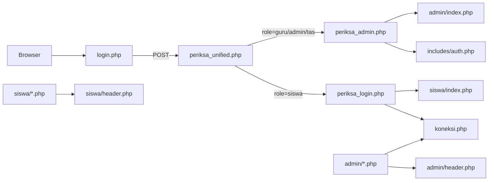

# PROJECT BLUEPRINT — EPOIN

**Dokumen:** Analisis arsitektur aplikasi (read-only)  
**Lokasi project:** `C:\laragon\www\epoin`  
**Database lokal:** `epoin_local`  
**Tanggal:** 2026-05-19  

> Tidak ada kode aplikasi yang diubah. Semua secret ditulis sebagai `[REDACTED]`.

---

## A. IDENTITAS PROJECT

| Item | Keterangan |
|------|------------|
| **Nama** | EPOIN (E-POIN) |
| **Jenis aplikasi** | Sistem manajemen poin siswa, absensi, penilaian, rapor, ujian (Google Form), dan modul e-Tugas untuk sekolah |
| **Framework** | **Native PHP** — bukan Laravel/CodeIgniter full-stack |
| **Pola arsitektur** | **Page-based monolith** + partial shared includes (header, `koneksi.php`, `includes/auth.php`) |
| **Campuran** | AdminLTE 2 + Bootstrap 3 (frontend static), beberapa modul pakai AJAX/PDO terpisah |
| **PHP disarankan** | **8.1+** (lokal teruji PHP 8.3) |
| **Web server** | **Apache** (Laragon); production cocok Apache atau Nginx + PHP-FPM |
| **Database** | **MySQL 8.x** / MariaDB kompatibel, charset `utf8mb4` |
| **Composer** | **Tidak ada `composer.json` di root** — dependency PHP mostly bundled di `assets/` dan `vendor/` (jika ada) |
| **npm/package.json** | **Tidak ditemukan** di root — frontend vendor via Bower/AdminLTE lokal |
| **Dependency utama (frontend)** | Bootstrap 3, AdminLTE, Font Awesome, jQuery (di `assets/bower_components/`, `assets/dist/`) |

### Cara menjalankan di Laragon

| Item | Nilai |
|------|--------|
| URL | `http://localhost:8088/epoin/` |
| SSL opsional | `https://localhost:8448/epoin/` |
| MySQL port | `3308` |
| DB name | `epoin_local` |

**Langkah:**

1. Letakkan project di `C:\laragon\www\epoin`
2. Salin `.env.example` → `.env` (jangan commit `.env`)
3. Import dump SQL ke `epoin_local` (dokumentasi menyebut ~62 tabel)
4. Import opsional migrasi manual: `database/manual-migrations/2026-05-17-001-create-etugas-tables.sql` (modul e-Tugas)
5. Buka `http://localhost:8088/epoin/login.php`

**Alur koneksi DB:** `koneksi.php` → `config/database.php` → `includes/env.php` (baca `.env`) → variabel `$koneksi` (mysqli).

---

## B. STRUKTUR FOLDER

| Folder | Fungsi | GitHub | .gitignore | Upload/cache/log |
|--------|--------|--------|------------|------------------|
| `/` (root) | Entry redirect, login UI, handler login | Ya (pilih file) | `.env`, `*.sql` | — |
| `admin/` | Panel admin/guru/TAS (~140+ file PHP) | Ya | — | — |
| `siswa/` | Panel siswa (~22 file PHP) | Ya | — | — |
| `includes/` | Auth RBAC, env loader, helpers (e-Tugas, usage, theme) | Ya | — | — |
| `config/` | Konfigurasi DB (`database.php`) | Ya | — | — |
| `assets/` | CSS/JS AdminLTE, Bootstrap, plugins | Ya (besar) | — | Static vendor |
| `database/` | Migrasi SQL manual (e-Tugas) | Ya (hanya `manual-migrations/*.sql`) | `*.sql` kecuali exception | — |
| `docs/` | Dokumentasi deploy/QA | Opsional | Boleh diabaikan di prod | — |
| `gambar/` | Gambar/logo aplikasi | Ya | — | Media |
| `uploads/` | Upload file user (jika dipakai) | **Jangan** commit isi | **Wajib ignore** | **Ya** |
| `library/` | Library tambahan | Cek isi | Cek | Mungkin |
| `security/` | Util keamanan (jika ada) | Ya | — | — |
| `vendor/` | Dependency PHP (jika ada) | Tergantung kebijakan | Bisa ignore jika reproducible | — |
| `cgi-bin/` | Legacy Apache | Biasanya tidak perlu | Ignore | — |
| `tests/` | Harness QA CLI (e-Tugas) | **Tidak** ke production | **Wajib ignore** | — |

**File root penting:** `index.php`, `login.php`, `koneksi.php`, `periksa_unified.php`, `periksa_login.php`, `periksa_admin.php`, `admin.php`, `logout.php`, `.env.example`, `.gitignore`.

---

## C. ENTRY POINT APLIKASI

### Entry browser

| URL | File | Perilaku |
|-----|------|----------|
| `/epoin/` | `index.php` | Redirect ke `login.php` |
| `/epoin/login.php` | `login.php` | UI login unified (siswa + staff) |
| `/epoin/admin/` | `admin/index.php` | Dashboard admin (perlu session) |
| `/epoin/siswa/` | `siswa/index.php` | Dashboard siswa (perlu session) |

### Alur request (ringkas)



### Routing

- **Manual routing** — tidak ada front controller/router framework.
- Setiap halaman = satu file `.php` di `admin/` atau `siswa/`.
- **Pemisahan role:** folder `admin/` vs `siswa/` + `$_SESSION['level']`.

### Konfigurasi utama

| File | Fungsi |
|------|--------|
| `config/database.php` | Host, user, pass, DB, port via `.env` |
| `includes/env.php` | Loader `.env` minimal |
| `includes/auth.php` | Login staff + RBAC session |
| `admin/header.php` | Session guard, menu, role helpers, usage quota |
| `siswa/header.php` | Guard `level === siswa` |

---

## D. ROUTING DAN HALAMAN

### Autentikasi

| Route / aksi | File | Role |
|--------------|------|------|
| Login UI | `login.php` | Publik |
| Router POST login | `periksa_unified.php` | Publik |
| Login siswa | `periksa_login.php` | → session siswa |
| Login staff | `periksa_admin.php` + `includes/auth.php` | → session admin/guru/TAS |
| Redirect admin lama | `admin.php` | → `login.php` |
| Logout admin | `admin/logout.php` | Staff |
| Logout siswa | `siswa/logout.php` | Siswa |

### Admin — modul utama (contoh)

| Area | Contoh file | Fungsi |
|------|-------------|--------|
| Dashboard | `admin/index.php` | KPI, ranking poin, aktivitas |
| Master siswa | `admin/siswa.php`, `siswa_act.php`, `siswa_import.php` | CRUD + import |
| Kelas / TA | `admin/kelas.php`, `admin/ta.php` | Master akademik |
| Mapel / pengampu | `admin/mapel.php`, `admin/pengampu_mapel.php` | Penugasan guru |
| Pelanggaran | `admin/pelanggaran.php`, `input_pelanggaran.php` | Master + input |
| Prestasi | `admin/prestasi.php`, `input_prestasi.php` | Master + input |
| Absensi harian | `admin/absensi_harian.php` | Kehadiran H/I/S/A |
| Absensi mapel | `admin/absensi_mapel.php` | Absensi per mapel |
| Nilai | `admin/nilai_harian.php`, `admin/nilai_pts.php` | Penilaian |
| Rapor / STS | `admin/leger_rapor_sts.php`, `admin/rapor_sts_*.php` | Cetak/generate rapor |
| Ujian GForm | `admin/ujian_gform.php` | Integrasi ujian |
| e-Tugas | `admin/etugas.php`, `etugas_rekap.php`, dll. | Tugas siswa |
| User/RBAC | `admin/user.php`, `admin/users/` | Manajemen user |
| Sekolah / lisensi | `admin/sekolah.php` | Tenant, backup DB, lisensi |
| Laporan / export | `admin/laporan.php`, `admin/export_csv.php` | Export |
| Pengaturan | `admin/sekolah.php`, `admin/manajemen_pengguna.php` | Settings |

### Siswa

| File | Fungsi |
|------|--------|
| `siswa/index.php` | Dashboard poin & kehadiran |
| `siswa/pelanggaran_saya.php` | Riwayat pelanggaran |
| `siswa/prestasi_saya.php` | Riwayat prestasi |
| `siswa/absensi.php` | Absensi |
| `siswa/tugas_saya.php` | e-Tugas |
| `siswa/ujian.php`, `exam_gform.php` | Ujian |
| `siswa/profil.php` | Profil |

---

## E. MODUL APLIKASI

### 1. Autentikasi & user

- **Fungsi:** Login/logout terpisah siswa vs staff; RBAC untuk staff.
- **File:** `periksa_unified.php`, `periksa_login.php`, `periksa_admin.php`, `includes/auth.php`, `admin/user.php`.
- **Tabel:** `siswa`, `user`, `roles`, `user_roles`, `role_permissions`, `permissions`.
- **Risiko:** Login siswa pakai **MD5 + query string** (lihat Security Audit).

### 2. Poin pelanggaran & prestasi (inti EPOIN)

- **Fungsi:** Master jenis pelanggaran/prestasi; input per siswa; agregasi poin.
- **File:** `admin/pelanggaran.php`, `admin/prestasi.php`, `admin/input_pelanggaran.php`, `siswa/poin.php`.
- **Tabel:** `pelanggaran`, `prestasi`, `input_pelanggaran`, `input_prestasi`.
- **Alur:** Input → join master → SUM point → saldo = prestasi − pelanggaran.

### 3. Absensi

- **Fungsi:** Absensi harian (status H/I/S/A) dan absensi per mapel/sesi.
- **File:** `admin/absensi_harian.php`, `admin/absensi_mapel.php`, `admin/laporan_absensi.php`.
- **Tabel:** `absensi_harian`, `absensi_harian_detail`, `absensi_sesi`, `absensi_sesi_detail`, `permohonan_absensi`.
- **Fitur:** Finalisasi absensi, audit log inline di `absensi_harian.php`.

### 4. Nilai & rapor

- **Fungsi:** Nilai harian, PTS, deskripsi, cetak rapor STS/e-Rapor.
- **File:** `admin/nilai_harian.php`, `admin/nilai_pts.php`, `admin/deskripsi_pts.php`, `admin/rapor_sts_*.php`.
- **Tabel:** Berbagai tabel nilai/rapor (nama exact dari dump DB).

### 5. Ujian Google Form

- **File:** `admin/ujian_gform.php`, `siswa/exam_gform.php`, `siswa/ujian.php`.

### 6. e-Tugas (modul terbaru)

- **Fungsi:** Guru/admin buat tugas; siswa submit teks/link; review; rekap CSV; multi-kelas create; safe delete.
- **File:** `includes/etugas_helpers.php`, `admin/etugas*.php`, `siswa/tugas_*.php`.
- **Tabel:** `etugas`, `etugas_pengumpulan` (migrasi di repo).

### 7. Sekolah / tenant / kuota

- **File:** `admin/sekolah.php`, `includes/usage_helper.php`.
- **Tabel:** `sekolah`, `sekolah_license`, `sekolah_license_log`, `tenant_quota`, `usage_log`.

### 8. Log & audit

- **Tabel:** `audit_log` (bisa auto-create), `log_aktivitas` (modul poin kolektif).
- **File:** `admin/absensi_harian.php`, `admin/poin_kolektif.php`.

---

## F. BUSINESS LOGIC / ALGORITMA

### Perhitungan poin siswa

**Rumus saldo:**

```
total_prestasi = SUM(prestasi.prestasi_point) dari input_prestasi
total_pelanggaran = SUM(pelanggaran.pelanggaran_point) dari input_pelanggaran
saldo = total_prestasi - total_pelanggaran
```

**File referensi:** `siswa/index.php`, `admin/index.php` (ranking), `admin/sp1_cetak.php` (tahapan pembinaan).

**Pseudocode:**

```
FOR each siswa IN kelas_ta:
  plus = SUM(points from input_prestasi JOIN prestasi)
  minus = SUM(points from input_pelanggaran JOIN pelanggaran)
  skor = plus - minus
ORDER BY skor DESC
```

### Tahapan pembinaan (SP)

Berdasarkan **saldo negatif** (`negSaldo = max(0, -saldo)`), mapping ke stage I–VI di `admin/sp1_cetak.php` (range poin → SP1/SP2/…).

### Role & permission

1. Login staff → `do_login_with_role()` validasi password (bcrypt **atau** MD5 legacy).
2. Load `user_roles` → `roles` → `permissions`.
3. Session: `$_SESSION['roles']`, `$_SESSION['perms']`.
4. Guard: `ensure_logged_in()`, `user_has_role()`, `can()` di `includes/auth.php` dan duplikat di `admin/header.php`.

### Lisensi / kuota sekolah

- `admin/header.php` load `sekolah_id` dari tabel `sekolah`.
- `usage_bootstrap()` memastikan `tenant_quota` + `usage_log`.
- Backup/restore/clear DB per kategori di `admin/sekolah.php`.

### e-Tugas — aturan submit

- Siswa hanya lihat tugas `status IN ('aktif','ditutup')` untuk kelasnya.
- Submit: validasi link aman, UPSERT ke `etugas_pengumpulan`.
- Guru review via `pengampu_mapel` scope, bukan hanya `guru_user_id`.

---

## G. KONFIGURASI

| Aspek | Localhost | VPS aaPanel |
|-------|-----------|-------------|
| `APP_ENV` | `local` | `production` |
| `DB_HOST` | `127.0.0.1` | `localhost` / socket |
| `DB_PORT` | `3308` | `3306` |
| `DB_DATABASE` | `epoin_local` | nama DB production |
| `DB_USERNAME/PASSWORD` | root / kosong | user DB dedicated |
| Error display | Tampil detail (mysqli strict) | Disembunyikan (`koneksi.php`) |
| Base URL | `/epoin/` | sesuai virtual host |
| Session | default PHP | pastikan `session.save_path` writable |

**File wajib beda environment:** `.env` (tidak di Git), virtual host document root.

---

## H. KESIMPULAN ARSITEKTUR

### Kekuatan

- Modul lengkap untuk operasional sekolah (poin, absensi, nilai, tugas).
- Pola familiar untuk tim PHP (file per halaman).
- Modul e-Tugas dan auth staff sudah lebih modern (prepared statements, CSRF).
- `.env` + `.gitignore` sudah disiapkan untuk deploy.

### Kelemahan

- **Inkonsistensi keamanan** antara modul lama (string SQL, MD5) vs modul baru.
- Tidak ada framework routing → banyak duplikasi guard session.
- Schema DB utama **tidak versioned penuh** di repo (hanya dump + 1 migrasi e-Tugas).
- Campuran mysqli dan PDO (`admin/poin_kolektif.php`).

### Risiko deploy

- Lupa upload `.env` production.
- Import dump salah urutan / charset.
- Folder `uploads/` permission salah.
- File sensitif (`phpinfo.php`, backup SQL) ter-expose.

### Prioritas sebelum production

1. **Critical:** Perbaiki login siswa (prepared statement + password_hash).
2. **Critical:** Audit query raw SQL di modul input poin/absensi.
3. **High:** CSRF global untuk form POST admin.
4. **High:** Hapus/block `admin/phpinfo.php` dan file debug.
5. **Medium:** Standarisasi session guard di semua halaman admin.

---

*Lihat juga: `DATABASE_BLUEPRINT_EPOIN.md`, `SECURITY_AUDIT_EPOIN.md`, `DEPLOYMENT_PLAN_GITHUB_AAPANEL.md`, `BRIEF_UNTUK_CHATGPT.md`*
