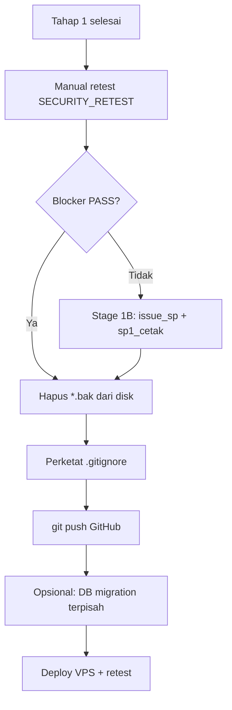

# STAGE 1B RECOMMENDATION — EPOIN

**Konteks:** Patch keamanan modul EPOIN **Tahap 1** selesai dengan verdict **PASS_WITH_NOTES**.  
**Dokumen terkait:** `PATCH_REVIEW_MODUL_EPOIN.md`, `SECURITY_RETEST_MODUL_EPOIN.md`

---

## 1. Apakah perlu patch tambahan sebelum migration DB?

**Ya — patch Stage 1B disarankan sebelum production dan sebelum push GitHub publik**, meskipun **tidak wajib mengubah schema database**.

Tahap 1 sudah mengamankan **jalur mutasi utama** (input master & transaksi poin). Yang tersisa adalah **endpoint sekunder** (SP, laporan) dan **higiene repo** (backup, gitignore, secret rotation).

**Migration DB** (kolom baru, index UNIQUE anti-duplikat, dll.) boleh **ditunda** ke fase terpisah setelah 1B stabil.

---

## 2. Daftar file yang harus dipatch di Stage 1B

### P0 — Wajib (security blocker)

| File | Perbaikan |
|------|-----------|
| `admin/siswa_riwayat.php` (blok `ajax=issue_sp`) | `epoin_staff_guard` + CSRF + prepared statement untuk semua query SP |
| `admin/sp1_cetak.php` | Prepared untuk `sp_log` SELECT/INSERT; hindari `alasan` dari GET langsung ke SQL |

### P1 — Sangat disarankan

| File | Perbaikan |
|------|-----------|
| `admin/laporan.php` | Prepared / bound params untuk filter `ta_id`, `kelas_id` |
| `admin/rekap_tahunan.php` | `(int)$tahun` + prepared atau whitelist tahun |
| `admin/input_pelanggaran_hapus.php` + `input_prestasi_hapus.php` | Opsional: cek role wali / ownership record |
| `.gitignore` | Tambah `uploads/`, `vendor/`, `tests/`, `node_modules/` |
| **Operasional** | Hapus atau pindahkan 20 file `admin/*.bak` ke luar project |

### P2 — Patch terpisah (di luar modul EPOIN admin strict)

| File | Perbaikan |
|------|-----------|
| `periksa_login.php` | Prepared + `password_verify`; hapus MD5 |
| `admin/index.php` | Hardening query KPI (bisa Stage 3) |

### P3 — Peningkatan (bukan blocker)

| Item | Perbaikan |
|------|-----------|
| Flash messages | Tampilkan `flash_error`/`flash_success` dengan `epoin_h()` di layout |
| `epoin_verify_siswa_kelas` | Opsional join filter **TA aktif** |
| Duplikasi input | UNIQUE business key atau approval workflow — **butuh desain + migration** |

---

## 3. Apakah boleh lanjut ke database migration?

| Kondisi | Rekomendasi |
|---------|-------------|
| Hanya migration **manual** e-Tugas / schema existing | **Boleh** — tidak bentrok dengan patch 1 |
| Migration **baru** (UNIQUE, status approval, audit table) | **Setelah** Stage 1B + retest PASS |
| Migration di production | Selalu backup SQL dulu |

Patch Tahap 1 **tidak mengubah** tabel/kolom — rollback kode tidak perlu rollback DB.

---

## 4. Apakah boleh lanjut ke GitHub?

| Kondisi | Status |
|---------|--------|
| Push source handler Tahap 1 | **Boleh** dengan catatan |
| Push file `*.bak` | **Tidak boleh** — sudah di `.gitignore`, verifikasi `git status` |
| Push `.env` | **Tidak boleh** |
| Push dump `*.sql` | **Tidak boleh** |

### Checklist pre-push

```bash
git status
# Pastikan tidak muncul: .env, *.bak, *.sql, uploads isi file user
```

### Perketat `.gitignore` (disarankan di 1B)

```gitignore
uploads/*
!uploads/.gitkeep
vendor/
tests/
node_modules/
```

### Secret rotation

Jika `admin/poin_kolektif.php.bak` pernah:

- Di-commit ke Git, atau
- Dibagikan di zip backup, atau
- Ada di server staging publik

→ **Rotasi password user MySQL** `[REDACTED]` sebelum go-live.

Credential **tidak ada** di file PHP aktif prioritas; hanya di `.bak`.

---

## 5. Urutan kerja yang disarankan



---

## 6. Kesimpulan keputusan

| Pertanyaan | Jawaban |
|------------|---------|
| Patch 1 setengah jalan? | **Tidak** untuk handler prioritas; **ya** untuk SP/laporan/login siswa |
| Perlu 1B sebelum prod? | **Ya** minimal P0 (`issue_sp`, `sp1_cetak`) |
| Boleh migration DB sekarang? | **Boleh** jika tidak mengubah schema; fitur baru migration tunggu 1B |
| Boleh GitHub sekarang? | **Boleh** setelah hapus `.bak` dari working tree + `git check-ignore` + rotasi secret jika perlu |
| Rotasi credential? | **Ya** jika password di `poin_kolektif.php.bak` pernah exposed |

---

## 7. Estimasi effort Stage 1B

| Paket | Effort | Dampak |
|-------|--------|--------|
| P0 SP endpoints | 4–8 jam | Tutup CSRF/SQLi critical |
| P1 laporan/rekap | 2–4 jam | Tutup SQLi read/report |
| Repo hygiene | 1 jam | Cegah leak secret |
| Retest penuh | 2–3 jam | Validasi regression |

**Total:** ~1–2 hari kerja focused.

---

*Stage 1B tidak menggantikan audit profesional atau pentest, tetapi menutup gap yang teridentifikasi review Tahap 1.*
