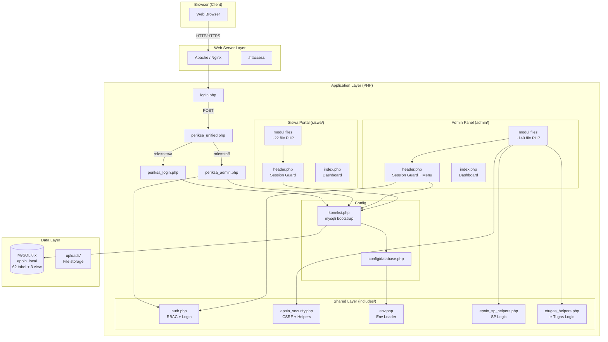
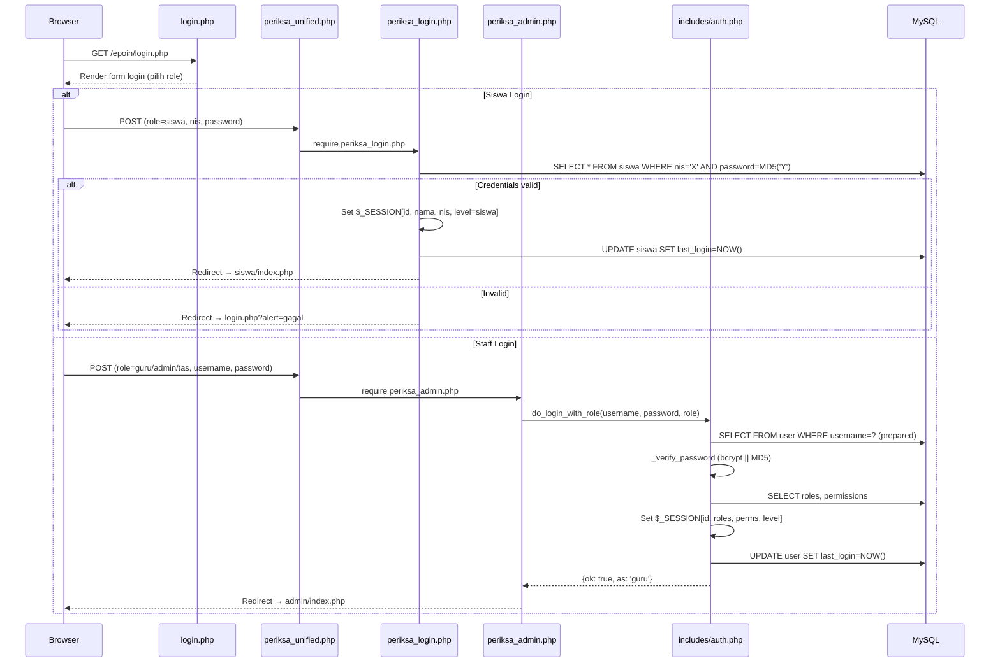
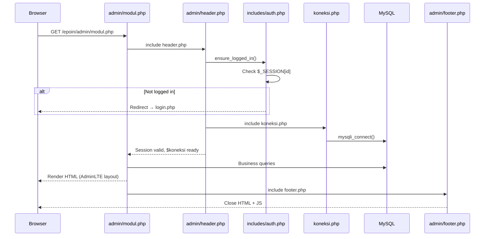
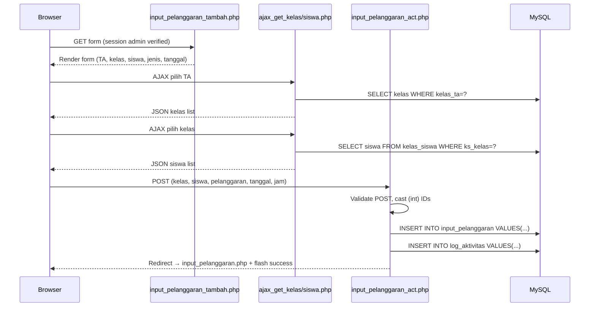
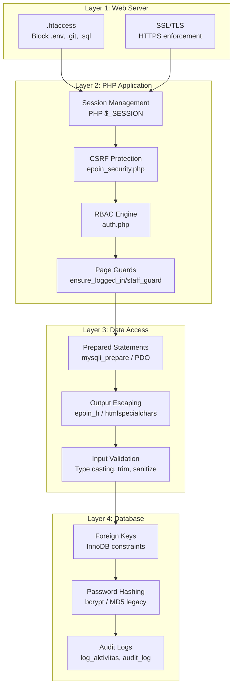
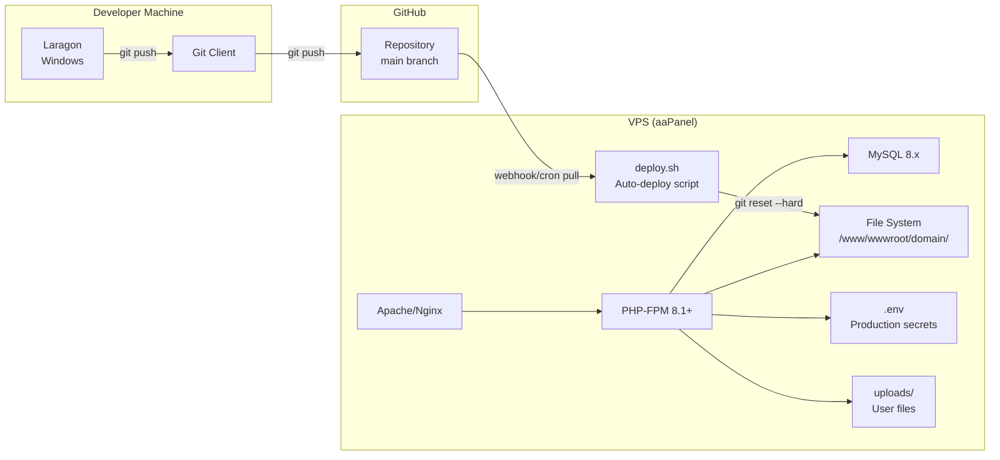

# 🏗️ SYSTEM DESIGN DOCUMENT (SDD)
# EPOIN — E-Point Siswa

**Versi Dokumen:** 1.0  
**Tanggal:** 2026-05-28  
**Status:** Final Draft  
**Audit Codebase:** ~187 file PHP, 62 tabel/view MySQL

---

## 1. Gambaran Umum Arsitektur

### 1.1 Pola Arsitektur

EPOIN menggunakan arsitektur **Native PHP Monolith (Page-Based)** — setiap URL endpoint dipetakan langsung ke satu file PHP. Tidak ada framework MVC (Laravel/CodeIgniter/Yii) yang digunakan. Pola ini dikenal sebagai **"file-per-page"** pattern.



### 1.2 Lapisan Arsitektur

| Lapisan | Implementasi | File/Folder |
|---------|-------------|-------------|
| **Presentasi** | PHP inline HTML + AdminLTE 2 + Bootstrap 3 + jQuery | `admin/header.php`, `siswa/header.php`, `admin/footer.php` |
| **Aplikasi (Business Logic)** | File `.php` per fitur | `admin/*.php`, `siswa/*.php` |
| **Shared Logic / Service** | Helper functions, tidak OOP | `includes/*.php` |
| **Data Access** | mysqli (dominan) + PDO (minor) | `koneksi.php`, inline queries |
| **Konfigurasi** | `.env` + PHP config | `config/database.php`, `includes/env.php` |
| **Routing** | Manual URL → file (no front controller) | Apache DirectoryIndex |

### 1.3 Keputusan Arsitektur Kunci

| Keputusan | Rasional | Trade-off |
|-----------|----------|-----------|
| **Native PHP (no framework)** | Familiar untuk tim PHP sekolah, zero dependency | Duplikasi kode, tidak ada ORM/routing standard |
| **Page-per-file routing** | Simpel, mudah debug per URL | Tidak ada middleware, guard harus di-include manual |
| **mysqli dominan** | Bawaan PHP, performa bagus | Tidak ada query builder, rawan SQLi jika tidak prepared |
| **AdminLTE 2 + Bootstrap 3** | Template admin yang mature dan well-documented | Versi lama (Bootstrap 3), tidak ada komponen modern |
| **Vendor directory committed** | Tidak ada `composer.json` root | Repo size besar, dependency sulit di-update |
| **Session-based auth** | Standard PHP, simpel | Tidak stateless, perlu session storage management |

---

## 2. Tech Stack Detail

### 2.1 Backend

| Komponen | Teknologi | Versi | Catatan |
|----------|-----------|-------|---------|
| **Runtime** | PHP | 8.1+ (teruji 8.3) | `strict_types` di file baru |
| **Database** | MySQL | 8.x (lokal 8.4.3) | InnoDB, utf8mb4, MariaDB compatible |
| **Web Server** | Apache (Laragon) | 2.4.x | Production: Apache atau Nginx + PHP-FPM |
| **DB Driver** | mysqli | Built-in | Dominan; PDO untuk `poin_kolektif.php` |
| **PDF Generation** | FPDF | 1.85 | Di `library/fpdf185/` |
| **Excel Processing** | PhpSpreadsheet | via vendor | Import siswa |
| **Env Loader** | Custom (`env.php`) | — | Bukan vlucas/phpdotenv |

### 2.2 Frontend

| Komponen | Teknologi | Versi | Lokasi |
|----------|-----------|-------|--------|
| **CSS Framework** | Bootstrap | 3.x | `assets/bower_components/bootstrap/` |
| **Admin Template** | AdminLTE | 2.x | `assets/dist/` |
| **JavaScript** | jQuery | 3.x | `assets/bower_components/jquery/` |
| **Icons** | Font Awesome | 4.x | `assets/bower_components/font-awesome/` |
| **DataTables** | jQuery DataTables | — | `assets/plugins/datatables/` |
| **Charts** | Chart.js / inline | — | Dashboard KPI |
| **Date Picker** | Bootstrap Datepicker | — | `assets/plugins/` |

### 2.3 Infrastructure

| Aspek | Lokal (Development) | Production (Target) |
|-------|--------------------|--------------------|
| **Server** | Laragon (Windows) | VPS aaPanel (Linux) |
| **URL** | `http://localhost:8088/epoin/` | `https://epoin.sekolah.sch.id/` |
| **DB Port** | 3308 | 3306 |
| **SSL** | Opsional (port 8448) | Let's Encrypt (wajib) |
| **PHP Error** | Display on | Display off, error_log only |
| **Deploy** | Direct file | Git pull + `deploy.sh` |

---

## 3. Alur Request & Response

### 3.1 Login Flow



### 3.2 Admin Page Request Flow



### 3.3 Poin Input Flow



---

## 4. Desain Database

### 4.1 Spesifikasi Database

| Properti | Nilai |
|----------|-------|
| **Engine** | InnoDB |
| **Charset** | utf8mb4 |
| **Collation** | utf8mb4_unicode_ci |
| **Nama DB (lokal)** | epoin_local |
| **Total Objek** | 62 (59 tabel + 3 view) |
| **Migrasi di repo** | 1 file SQL (e-Tugas) |

### 4.2 Entity Relationship Diagram

```mermaid
erDiagram
    sekolah ||--o{ user : "has staff"
    sekolah ||--o{ sekolah_staff : "positions"
    sekolah ||--o{ sekolah_license : "licensed"
    sekolah ||--o{ tenant_quota : "quota"

    user ||--o{ user_roles : "assigned"
    roles ||--o{ user_roles : "includes"
    roles ||--o{ role_permissions : "grants"
    permissions ||--o{ role_permissions : "permitted"

    ta ||--o{ kelas : "contains"
    jurusan ||--o{ kelas : "program"
    kelas ||--o{ kelas_siswa : "roster"
    siswa ||--o{ kelas_siswa : "enrolled"
    kelas ||--o{ kelas_wali : "homeroom"
    user ||--o{ kelas_wali : "assigned as wali"

    kelas ||--o{ pengampu_mapel : "teaching"
    mapel ||--o{ pengampu_mapel : "subject"
    user ||--o{ pengampu_mapel : "teaches"

    siswa ||--o{ input_pelanggaran : "receives violation"
    pelanggaran ||--o{ input_pelanggaran : "type definition"
    siswa ||--o{ input_prestasi : "earns achievement"
    prestasi ||--o{ input_prestasi : "type definition"

    siswa ||--o{ sp_log : "issued SP"

    kelas ||--o{ absensi_harian : "daily attendance"
    absensi_harian ||--o{ absensi_harian_detail : "per student"
    siswa ||--o{ absensi_harian_detail : "status H/I/S/A"

    kelas ||--o{ absensi_sesi : "session attendance"
    absensi_sesi ||--o{ absensi_sesi_detail : "per student"

    etugas ||--o{ etugas_pengumpulan : "submissions"
    siswa ||--o{ etugas_pengumpulan : "submits"

    ujian_gform ||--o{ ujian_gform_kelas : "assigned classes"
    ujian_gform ||--o{ ujian_gform_attempt : "attempts"
    siswa ||--o{ ujian_gform_attempt : "takes exam"
```



### 4.3 Inventaris Tabel Lengkap (62 Objek)

#### Tabel Inti Akademik (11)

| Tabel | PK | Fungsi | FK Penting |
|-------|-----|--------|------------|
| `siswa` | siswa_id | Master siswa + kredensial login | — |
| `user` | user_id | Akun staff | sekolah_id |
| `ta` | ta_id | Tahun ajaran | — |
| `kelas` | kelas_id | Kelas per TA | ta_id, jurusan_id |
| `kelas_siswa` | id | Relasi siswa–kelas | kelas_id, siswa_id |
| `kelas_wali` | id | Wali kelas per TA | user_id, kelas_id |
| `jurusan` | jurusan_id | Master jurusan | — |
| `mapel` | mapel_id | Master mata pelajaran | — |
| `pengampu_mapel` | id | Guru–mapel–kelas | user_id, mapel_id, kelas_id |
| `sekolah` | id | Data tenant/sekolah | — |
| `sekolah_staff` | id | Posisi struktural | sekolah_id, user_id |

#### Tabel Auth & RBAC (4)

| Tabel | Fungsi |
|-------|--------|
| `roles` | Definisi role (administrator, guru, tas, piket, sekretaris) |
| `user_roles` | Assign role ke user (M:N) |
| `permissions` | Permission keys (7 entri, fokus absensi) |
| `role_permissions` | Mapping role → permission (M:N) |

#### Tabel Poin EPOIN (5)

| Tabel | Fungsi |
|-------|--------|
| `pelanggaran` | Master jenis pelanggaran + poin |
| `prestasi` | Master jenis prestasi + poin |
| `input_pelanggaran` | Transaksi pelanggaran per siswa |
| `input_prestasi` | Transaksi prestasi per siswa |
| `sp_log` | Log surat peringatan SP1–SP4 |

#### Tabel Absensi (5)

| Tabel | Fungsi |
|-------|--------|
| `absensi_harian` | Header absensi harian per kelas |
| `absensi_harian_detail` | Detail status H/I/S/A per siswa |
| `absensi_sesi` | Header absensi per sesi mapel |
| `absensi_sesi_detail` | Detail absensi sesi per siswa |
| `permohonan_absensi` | Workflow permohonan perubahan absensi |

#### Tabel Penilaian & Rapor (~15)

| Tabel | Fungsi |
|-------|--------|
| `tujuan_pembelajaran` | Master TP per mapel |
| `nilai_harian_set` | Set penilaian harian |
| `nilai_harian_tp` | TP per set NH |
| `nilai_harian_penilaian` | Kegiatan penilaian |
| `nilai_harian_nilai` | Nilai per siswa per TP |
| `nilai_harian` | Data nilai harian |
| `nilai_pts_set` | Set PTS |
| `nilai_pts_tp` | TP per set PTS |
| `nilai_pts` | Nilai PTS per siswa |
| `rapor_pts_deskripsi` | Deskripsi rapor PTS |
| `rapor_pts_publish` | Status publish rapor PTS |
| `rapor_sts_files` | File rapor STS |
| `rapor_sts_print_config` | Config cetak rapor |
| `rapor_sts_publish` | Status publish rapor STS |
| `jenis_penilaian`, `penilaian_setup`, `penilaian_kegiatan` | Setup penilaian |

#### Tabel Ujian & Tugas (6)

| Tabel | Fungsi |
|-------|--------|
| `ujian_gform` | Definisi ujian Google Form |
| `ujian_gform_kelas` | Kelas yang diassign ujian |
| `ujian_gform_attempt` | Attempt siswa |
| `ujian_gform_violation` | Log pelanggaran ujian |
| `etugas` | Definisi tugas guru |
| `etugas_pengumpulan` | Pengumpulan tugas siswa (UNIQUE per tugas+siswa) |

#### Tabel Tenant, Lisensi, Audit (~10)

| Tabel | Fungsi |
|-------|--------|
| `sekolah_license` | Data lisensi per sekolah |
| `sekolah_license_log` | Log event lisensi |
| `license_codes` | Kode lisensi |
| `tenant_quota` | Kuota disk/bandwidth |
| `usage_log` | Log pemakaian |
| `usage_daily` | Agregasi pemakaian harian |
| `log_aktivitas` | Audit aktivitas guru |
| `audit_log` | Audit terstruktur |
| `pengumuman` | Pengumuman siswa |

#### Tabel Kalender (4)

| Tabel | Fungsi |
|-------|--------|
| `kalender_libur` | Hari libur kustom |
| `libur_nasional` | Hari libur nasional |
| `hari_efektif` | Hari efektif per bulan |
| `view_non_efektif` | View hari non-efektif |

#### Database Views (3)

| View | Fungsi |
|------|--------|
| `v_rapor_pts_deskripsi` | Agregasi deskripsi rapor PTS |
| `v_rapor_pts_deskripsi_final` | Deskripsi final rapor PTS |
| `v_users_with_roles` | User dengan roles |

### 4.4 Kolom Tabel Inti

#### `siswa`

```sql
siswa_id        INT PRIMARY KEY AUTO_INCREMENT
siswa_nis       VARCHAR       -- Nomor Induk Siswa (unique)
siswa_nama      VARCHAR       -- Nama lengkap
siswa_jurusan   INT           -- FK → jurusan.jurusan_id
siswa_status    VARCHAR       -- Aktif/Non-aktif
siswa_password  VARCHAR       -- Hash password (MD5 legacy)
last_login      DATETIME      -- Login terakhir
status_login    ENUM          -- online/offline
```

#### `user`

```sql
user_id           INT PRIMARY KEY AUTO_INCREMENT
user_username     VARCHAR       -- Username/NIP
user_nama         VARCHAR       -- Nama lengkap
user_password     VARCHAR       -- Hash (bcrypt atau MD5)
user_level        VARCHAR       -- Legacy level field
user_foto         VARCHAR       -- Path foto profil
linked_siswa_id   INT           -- FK → siswa (untuk akun sekretaris)
last_login        DATETIME
sekolah_id        INT           -- FK → sekolah
```

#### `input_pelanggaran`

```sql
id           INT PRIMARY KEY AUTO_INCREMENT
waktu        DATETIME       -- Timestamp pelanggaran
siswa        INT            -- FK → siswa.siswa_id
kelas        INT            -- FK → kelas.kelas_id (saat input)
pelanggaran  INT            -- FK → pelanggaran.pelanggaran_id
ip_ym        VARCHAR(6)     -- Opsional: YYYYMM untuk optimasi bulanan
```

#### `sp_log`

```sql
id                 INT PRIMARY KEY AUTO_INCREMENT
siswa_id           INT              -- FK → siswa
sp_level           ENUM('SP1','SP2','SP3','SP4')
running_no         INT              -- Nomor urut per level per tahun
nomor              VARCHAR(64)      -- Nomor surat: SEQ/SP/SCHOOL/SYEAR
alasan             TEXT             -- Alasan penerbitan
signer_user_id     INT              -- FK → user (Guru BP)
signer_posisi_key  ENUM             -- kepala/wakasek/guru_bp
signer_nama        VARCHAR(120)     -- Snapshot nama penandatangan
signer_jabatan     VARCHAR(120)     -- Snapshot jabatan
tanggal            DATETIME         -- Tanggal terbit
```

### 4.5 Relasi & Agregasi Kunci

```
┌─────────────────────────────────────────────────────┐
│                  SALDO POIN SISWA                    │
│                                                     │
│  saldo = SUM(prestasi.prestasi_point)               │
│        - SUM(pelanggaran.pelanggaran_point)          │
│                                                     │
│  Dari: input_prestasi JOIN prestasi                 │
│      - input_pelanggaran JOIN pelanggaran            │
│  WHERE siswa = ?                                    │
│                                                     │
│  negSaldo = MAX(0, -saldo)                          │
│  → Menentukan tahap SP (SP1: ≥21, SP2: ≥41, ...)   │
└─────────────────────────────────────────────────────┘
```

> **Penting:** Saldo **TIDAK** disimpan di kolom tabel siswa. Dihitung ulang (real-time aggregation) setiap kali dibutuhkan melalui JOIN query.

---

## 5. Desain Keamanan

### 5.1 Arsitektur Keamanan Multi-Layer



### 5.2 Autentikasi

#### Staff Authentication (Secured)

| Komponen | Implementasi |
|----------|-------------|
| **Query** | Prepared statement di `fetch_user_by_username()` |
| **Password** | Dual: `password_verify()` (bcrypt) + MD5 legacy fallback |
| **Session** | `user_id`, `username`, `roles[]`, `perms{}`, `level`, `active_role` |
| **Login timestamp** | Update `last_login` + `status_login='online'` |
| **Role validation** | Cek role di DB sebelum grant access |
| **Username rules** | Admin = alfanumerik; Guru/TAS = NIP numerik ≥8 digit |

#### Student Authentication (⚠️ Vulnerable)

| Komponen | Implementasi | Risiko |
|----------|-------------|--------|
| **Query** | String concatenation → **SQL Injection** | 🔴 Critical |
| **Password** | MD5 hash → **Weak crypto** | 🔴 Critical |
| **Session** | `id`, `nama`, `nis`, `level='siswa'` | — |

### 5.3 Otorisasi (RBAC)

```
user → user_roles → roles → role_permissions → permissions
                                ↓
                    can($permKey) → bool
                    user_has_role($roleKey) → bool
                    guard_roles([$allowed]) → 403 or pass
```

**7 Permission Keys Terdaftar:**

| Key | Deskripsi |
|-----|-----------|
| `attendance.harian.input` | Input absensi harian |
| `attendance.harian.view` | Lihat absensi harian |
| `attendance.mapel.own` | Kelola sesi mapel sendiri |
| `attendance.view_all` | Lihat semua sesi absensi |
| `attendance.final_any` | Finalisasi sesi |
| `attendance.delete_any` | Hapus sesi |
| `monitoring.view` | Dashboard monitoring |

> **⚠️ Gap:** Modul poin, nilai, dan ujian belum menggunakan `can()` — hanya cek `$_SESSION['level']` atau role login.

### 5.4 CSRF Protection

| Modul | Implementasi |
|-------|-------------|
| **e-Tugas** | ✅ `epoin_csrf_token()` + `epoin_csrf_validate()` |
| **SP Issue** | ✅ CSRF via POST + X-CSRF-TOKEN header |
| **Poin Input (baru)** | ⚠️ Token di form tapi **tidak divalidasi** di `*_act.php` |
| **CRUD Legacy** | ❌ Tidak ada CSRF |
| **Login** | ❌ Tidak ada CSRF |

### 5.5 SQL Injection Status per Modul

| Modul | Status | Detail |
|-------|--------|--------|
| Auth Staff | ✅ Aman | Prepared statements |
| Auth Siswa | 🔴 Vulnerable | String concat |
| e-Tugas | ✅ Aman | Full prepared statements |
| SP Helpers | ✅ Aman | Prepared statements |
| Security Module | ✅ Aman | Prepared statements |
| Poin Input (act) | ⚠️ Mixed | Prepared + fallback raw |
| Master CRUD | 🔴 Vulnerable | Raw SQL concat |
| Laporan/Export | ⚠️ Mixed | Some raw SQL with GET params |
| Absensi | ⚠️ Mixed | Varies per file |

---

## 6. Desain Komponen

### 6.1 Koneksi Database (`koneksi.php`)

```
┌──────────────────────────────────────────┐
│             koneksi.php                   │
│                                          │
│  require config/database.php             │
│    └─ require includes/env.php           │
│         └─ epoin_load_env() → .env       │
│    └─ $host, $user, $pass, $db, $port    │
│                                          │
│  APP_ENV check:                          │
│    local → MYSQLI_REPORT_STRICT          │
│    production → MYSQLI_REPORT_OFF        │
│                                          │
│  $koneksi = mysqli_connect(...)          │
│  $conn = $koneksi (alias)               │
│                                          │
│  charset: utf8mb4                        │
└──────────────────────────────────────────┘
```

### 6.2 Environment Loader (`includes/env.php`)

- Custom minimal `.env` loader (bukan vlucas/phpdotenv)
- Membaca file `.env` dari root project
- Support quoted values (`"value"` atau `'value'`)
- Tidak override env vars yang sudah ada (`getenv()` check)
- Fungsi `epoin_env($key, $default)` untuk akses

### 6.3 Security Helpers (`includes/epoin_security.php`)

| Function | Purpose |
|----------|---------|
| `epoin_h($value)` | HTML escaping (htmlspecialchars) |
| `epoin_csrf_token()` | Generate/retrieve CSRF token |
| `epoin_csrf_field()` | Render hidden input CSRF |
| `epoin_csrf_validate()` | Validate CSRF token (POST or X-CSRF-TOKEN header) |
| `epoin_staff_guard()` | Session guard for admin pages |
| `epoin_staff_guard_json()` | JSON API session guard (401 response) |
| `epoin_require_post()` | Enforce POST method |
| `epoin_verify_siswa_kelas()` | Validate student belongs to class |
| `epoin_column_exists()` | Check DB column existence |
| `epoin_log_aktivitas()` | Insert activity log (prepared statement) |
| `epoin_sum_prestasi_siswa()` | Calculate total prestasi (prepared) |
| `epoin_sum_pelanggaran_siswa()` | Calculate total pelanggaran (prepared) |
| `epoin_fetch_siswa_row()` | Fetch student with jurusan (prepared) |
| `epoin_get_pdo()` | Get PDO connection (singleton) |

### 6.4 SP Helpers (`includes/epoin_sp_helpers.php`)

| Function | Purpose |
|----------|---------|
| `epoin_sp_levels()` | Return valid SP levels array |
| `epoin_sp_validate_level()` | Validate SP level string |
| `epoin_sp_sanitize_alasan()` | Sanitize alasan text |
| `epoin_sp_ensure_schema()` | Auto-create/migrate sp_log table |
| `epoin_sp_saldo_for_siswa()` | Calculate saldo + negSaldo |
| `epoin_sp_can_issue_level()` | Check if SP level can be issued (threshold + sequential) |
| `epoin_sp_next_numbers()` | Generate next SP number (running + sequential) |
| `epoin_sp_insert_log()` | Insert SP record (full prepared statement) |
| `epoin_sp_ajax_issue_endpoint()` | Complete AJAX endpoint for SP issuance |

---

## 7. Deployment Architecture

### 7.1 Deployment Diagram



### 7.2 File Deployment

| File/Folder | Di GitHub | Di VPS | Catatan |
|-------------|-----------|--------|---------|
| Source PHP | ✅ | ✅ (via git pull) | Core aplikasi |
| `assets/` | ✅ | ✅ | Static vendor assets |
| `vendor/` | ✅ | ✅ | Committed (no composer) |
| `.env` | ❌ | ✅ (manual) | Beda per environment |
| `uploads/` | ❌ | ✅ (manual) | User content |
| `*.sql` | ❌ | Via import | Database dump |
| `tests/` | ❌ | ❌ | QA only |
| `.git/` | N/A | ✅ | Untuk git pull |

### 7.3 Rollback Strategy

```
1. Maintenance mode (pause site di aaPanel)
2. Restore DB: mysql epoin_prod < backup.sql
3. Restore code: tar -xzf backup_code.tar.gz  OR  git reset --hard <commit>
4. Verify .env dan uploads/ masih utuh
5. Test login + 1 modul kritis
6. Remove maintenance mode
```

---

## 8. API Internal (Endpoint AJAX/JSON)

### 8.1 Admin AJAX Endpoints

| Endpoint | Method | Fungsi | Response |
|----------|--------|--------|----------|
| `admin/ajax_get_kelas.php` | GET | Dropdown kelas by TA | HTML options |
| `admin/ajax_get_siswa.php` | GET | Dropdown siswa by kelas | HTML options |
| `admin/ajax_kelas_by_ta.php` | GET | Fragment kelas | HTML |
| `admin/ajax_siswa_by_kelas.php` | GET | Fragment siswa via kelas_siswa | HTML |
| `admin/get_kelas_by_ta.php` | GET | Kelas list | JSON |
| `admin/get_siswa_by_kelas.php` | GET | Siswa list | JSON |
| `admin/autocomplete_siswa.php` | GET | Autocomplete nama/NIS | JSON |
| `admin/get_status.php` | GET | Status monitoring absensi | JSON |
| `admin/siswa_riwayat.php?ajax=issue_sp` | POST | Terbitkan SP | JSON `{ok, msg, print_url}` |
| `admin/poin_kolektif.php?action=save_bulk` | POST | Input poin bulk | JSON |
| `admin/db_check_nh.php` | GET | Cek data nilai harian | JSON |

### 8.2 Response Format (JSON API)

```json
{
    "ok": true|false,
    "msg": "Human readable message",
    "error": "Error code (optional)",
    "data": {} // optional payload
}
```

---

## 9. Manajemen Session

### 9.1 Session Variables

#### Staff Session

```php
$_SESSION['id']           // int - user_id
$_SESSION['username']     // string - user_username
$_SESSION['user_nama']    // string - nama lengkap
$_SESSION['roles']        // array - ['guru', 'tas', ...]
$_SESSION['perms']        // assoc array - ['perm.key' => true, ...]
$_SESSION['level']        // string - role aktif (legacy compatibility)
$_SESSION['active_role']  // string - role yang dipilih saat login
$_SESSION['linked_siswa'] // int - linked_siswa_id (untuk sekretaris)
$_SESSION['sekolah_id']   // int - sekolah_id
$_SESSION['_csrf']        // string - CSRF token
```

#### Siswa Session

```php
$_SESSION['id']    // int - siswa_id
$_SESSION['nama']  // string - siswa_nama
$_SESSION['nis']   // string - siswa_nis
$_SESSION['level'] // string - 'siswa'
```

### 9.2 Session Guard Pattern

```
admin/header.php:
  → session_start() (if not active)
  → ensure_logged_in() → check $_SESSION['id']
  → Load sekolah_id, user roles/perms
  → Setup global $SEKOLAH_ID

siswa/header.php:
  → session_start()
  → Check $_SESSION['level'] === 'siswa'
  → Redirect to login if not
```

---

## 10. Struktur Folder Lengkap

```
epoin/
├── .env.example              # Template environment
├── .gitignore                # Git ignore rules
├── .htaccess                 # Apache rewrite rules
├── index.php                 # Entry: redirect → login.php
├── login.php                 # UI login unified (40KB)
├── koneksi.php               # DB bootstrap ($koneksi)
├── periksa_unified.php       # Login router (siswa/staff)
├── periksa_login.php         # Login siswa (⚠️ MD5+SQLi)
├── periksa_admin.php         # Login staff (→ auth.php)
├── logout.php                # Root logout
│
├── config/
│   └── database.php          # DB config ($host,$user,$pass,$db,$port)
│
├── includes/
│   ├── auth.php              # RBAC + Login helpers
│   ├── authnew.php           # Alternative auth (unused?)
│   ├── env.php               # Custom .env loader
│   ├── epoin_security.php    # CSRF, guards, validation helpers
│   ├── epoin_sp_helpers.php  # SP logic (prepared statements)
│   ├── eps_helpers.php       # Additional helpers
│   ├── etugas_helpers.php    # e-Tugas business logic (85KB)
│   ├── usage_helper.php      # Tenant quota tracking
│   ├── absensi_helper.php    # Attendance helpers
│   ├── deskripsi_helper.php  # Report description helpers
│   ├── theme_brand.php       # School branding
│   ├── modal_tentang_epoin.php # About modal (49KB)
│   └── app_secrets.php       # Secret constants
│
├── admin/                    # Staff panel (~140 files)
│   ├── header.php            # Session guard + menu (88KB)
│   ├── footer.php            # JS + closing (28KB)
│   ├── index.php             # Dashboard (65KB)
│   ├── [modul files...]      # Per-feature PHP files
│   ├── ajax/                 # AJAX handlers
│   ├── helpers/              # Admin-specific helpers
│   ├── includes/             # Admin includes
│   ├── penilaian/            # Penilaian sub-module
│   ├── tools/                # Admin tools
│   ├── users/                # User management
│   └── uploads/              # Admin uploads
│
├── siswa/                    # Student portal (~22 files)
│   ├── header.php            # Session guard
│   ├── footer.php            # JS + closing
│   ├── index.php             # Dashboard (86KB)
│   └── [modul files...]      # Per-feature PHP files
│
├── assets/                   # Frontend assets
│   ├── bower_components/     # Bootstrap 3, jQuery, Font Awesome
│   ├── dist/                 # AdminLTE 2 build
│   ├── plugins/              # DataTables, etc.
│   └── js/                   # Custom JS
│
├── database/
│   └── manual-migrations/    # SQL migration files
│
├── docs/                     # Documentation
│   ├── LOCAL_SETUP.md
│   ├── ai-agent-reports/
│   └── deployment-manifests/
│
├── library/
│   └── fpdf185/              # FPDF library
│
├── security/
│   └── security_headers.php  # HTTP security headers
│
├── gambar/                   # Application images
├── uploads/                  # User uploads (gitignored)
├── vendor/                   # PHP dependencies (committed)
├── tests/                    # QA harness (gitignored)
└── [documentation .md files] # Blueprint, audit, etc.
```

---

## 11. Rekomendasi Teknis

### 11.1 Quick Wins (Effort Rendah, Dampak Tinggi)

1. **Hapus `admin/phpinfo.php`** di production
2. **Block `.env`, `.git`** via web server config
3. **Pindahkan credential hardcoded** dari `poin_kolektif.php` ke `.env`
4. **`session_regenerate_id(true)`** setelah login berhasil
5. **Security headers** via `security/security_headers.php`

### 11.2 Medium-term Improvements

1. **Prepared statements** untuk semua query yang menerima user input
2. **CSRF middleware** global: generate di `header.php`, validate di setiap `*_act.php`
3. **Centralized auth guard**: single include untuk semua handler POST/DELETE
4. **Migration system**: extend `database/manual-migrations/` untuk semua schema changes
5. **Error handling**: centralized error handler dengan logging

### 11.3 Long-term Architecture

1. **Front controller pattern** (`index.php` router) untuk menggantikan direct file access
2. **Service layer** (PHP classes) untuk business logic
3. **`composer.json`** root dengan autoloading
4. **Template engine** atau PHP component separation (views vs logic)
5. **REST API** layer untuk integrasi mobile/external
6. **Database ORM** atau query builder

---

*Dokumen ini disusun dari inspeksi langsung terhadap seluruh codebase EPOIN dan database `epoin_local`. Untuk verifikasi skema terbaru, jalankan `SHOW TABLES` dan `SHOW CREATE TABLE` pada database lokal.*
